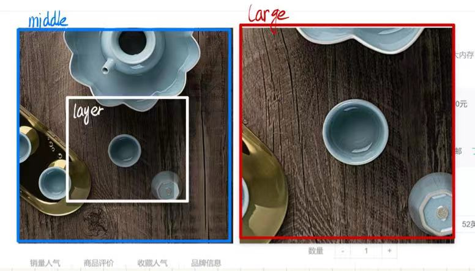

### 放大预览商品案例的实

#### 一、需求分析
* 鼠标经过竖列排向的预览图的时候，左侧的大框能够显示小图的预览，并且选中的图片显示边框高亮。
* 当鼠标进入左侧大图的时候，产生放大镜效果，将图放大两倍。并且在鼠标离开大图的时候，放大图效果保留一会再消失。

---
#### 二、具体实现
##### 1. 鼠标经过预览图，大框显示对应图片
* 由于父元素内仅有```<li></li>```,```</img>```，并不复杂，可以考虑事件委托。（由```</img>```委托至大盒子）
* 显示高亮很显然也是```.active```的问题，但是这里是给```</img>```的父亲```<li></li>```加上```.active```，所以要用上父节点```.parentNode```
* 关联图片就选中对应的盒子更该图源即可
##### 2. 放大效果
* （*）注意，放大的时候，大框里面会出现一个淡淡的黑色遮罩层，这里成为```layer```,大框称为```middle```，然后放大的预览图的盒子称为```large```
    
* 经过middle，显示layer；同理，离开middle，隐藏 layer（```.display```）
* 由于鼠标经过middle的时候，large要显示； 当鼠标放在large上面的时候，large还是要显示，离开同理，所以要对```show(){}```,```hide(){}```两个函数进行封装。并且，在隐藏large的时候，要停留一小会 $\rightarrow$ 用到定时器```setTimeout```,在显示的时候，要关闭定时器。
* **移动黑色遮罩层**：
    1. 重要的是获得黑色遮罩层相对于middle盒子的x、y位置
    x好办，x就是鼠标相对于视口的left值-middle盒子相对于视口的left值[```mouse.pageX - middle.getBoundingClient().left```]
    y比较麻烦，需要考虑页面下滑的情况，要保证页面下滑时，遮罩层也能同步随鼠标移动到对应的地方。所以在基本的基础上，它还要再减去页面被卷去的大小（```document.documentElement.scrollTop```）
    2. 然后就是去限制黑色遮罩层的移动范围：xy坐标，当在0-100、300-400内，layer不能移动，在100-300内可以移动。不能动那就是```x/y = 0```； 动就是```x - 100```。
    （！！*！！）注意啊，再取得x、y的值之后，不要忘记加上```'px'```
    3. **关联large的放大**：利用```backgroundPosition```的坐标变换即可。

---
#### 三、 代码
```Javascript
const middle = document.querySelector('.middle')
const small = document.querySelector('.small')
const large = document.querySelector('.large')

//事件委托，实现鼠标经过tab栏切换
//用mouseover而不是mouseleave
small.addEventListener('mouseover' , function (e) {
    if(e.target.tagName === 'IMG')
    {
        //清除已有
        this.querySelector('.active').classList.remove('active')
        //添加
        //注意是给img的父亲<li></li>去添加，用到父元素节点parentNode
        e.target.parentNode.classList.add('active')

        //给左侧显示盒子换同样的图片
        middle.querySelector('img').src = e.target.src

        //给大盒子加上相同的图片
        large.style.backgroundImage = `url(${e.target.src})`
    }
})

//鼠标经过以及显示
//延迟消失 → 定时器
let timer = null

function show () {
    //先清除定时器，如果有的话
    clearInterval(timer)
    large.style.display = 'block'
}

function hide () {
    timer = setTimeout(function () {
        large.style.display = 'none'
    } , 200)
}

//经过中等盒子（预览图）→显示大盒子
//鼠标经过大盒子的时候也要显示大盒子
large.addEventListener('mouseenter', show)
middle.addEventListener('mouseenter', show)

large.addEventListener('mouseleave', hide)
middle.addEventListener('mouseleave', hide)

//黑色遮罩层
const layer = document.querySelector('.layer')

//经过中等盒子。显示遮罩层
middle.addEventListener('mouseenter' , function() {
    layer.style.display = 'block'
})
middle.addEventListener('mouseleave' , function() {
    layer.style.display = 'none'
})

//移动黑色遮罩盒子

middle.addEventListener('mousemove' , function(e) {
    //得到鼠标相对于中等盒子的坐标x
    //.pageX 相对整个视口的x坐标
    //.getBoundingClientRect() 得到该元素相对于整个视口的坐标（包括x，y）
    let x = e.pageX - middle.getBoundingClientRect().left
    //对于y之而言，还要减去头部被卷去的大小，否则会出现光标和black layer不在同一图层上的效果
    let y = e.pageY - middle.getBoundingClientRect().top - document.documentElement.scrollTop

    //限制black layer的移动范围
    //通过鼠标的坐标去关联layer的坐标
    if(x >= 0 && x <= 400 && y >= 0 && y <= 400)
    {
        //xy坐标，当在0-100、300-400内，layer不能移动
        //在100-300内可以移动

        let x1 = 0, y1 = 0

        if(x < 100)
        {
            x1 = 0
        }
        else if(x >= 100 && x <= 300)
        {
            x1 = x - 100
            //layer可以动了
        }
        else if(x > 300)
        {
            x1 = 200
        }

        if(y < 100)
        {
            y1 = 0
        }
        else if(y >= 100 && y <= 300)
        {
            y1 = y - 100
            //layer可以动了
        }
        else if(y > 300)
        {
            y1 = 200
        }

        layer.style.left = x1 + 'px'
        layer.style.top = y1 + 'px'

        //再去关联大盒子的图片
        large.style.backgroundPositionX = -2 * x1 + 'px'
        large.style.backgroundPositionY = -2 * y1 + 'px'
    }
})
```

---

#### 四、 感谢阅读